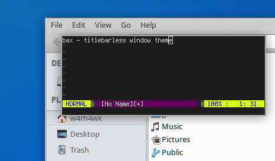

# BAX - xfce4 window theme

This theme is based on
[Axis](http://xfce-look.org/content/show.php/axis?content=95158) created by
Rogier Koppejan. I mainly removed the title bar since i don't need it.

## Screenshot

    

## Install

Simply drop the `bax`folder inside `~/.themes/`.

## No Titlebar?

Windowmanagement is done via keybaord shortcuts and mouse, my setup does not
require a titlebar to be present.
